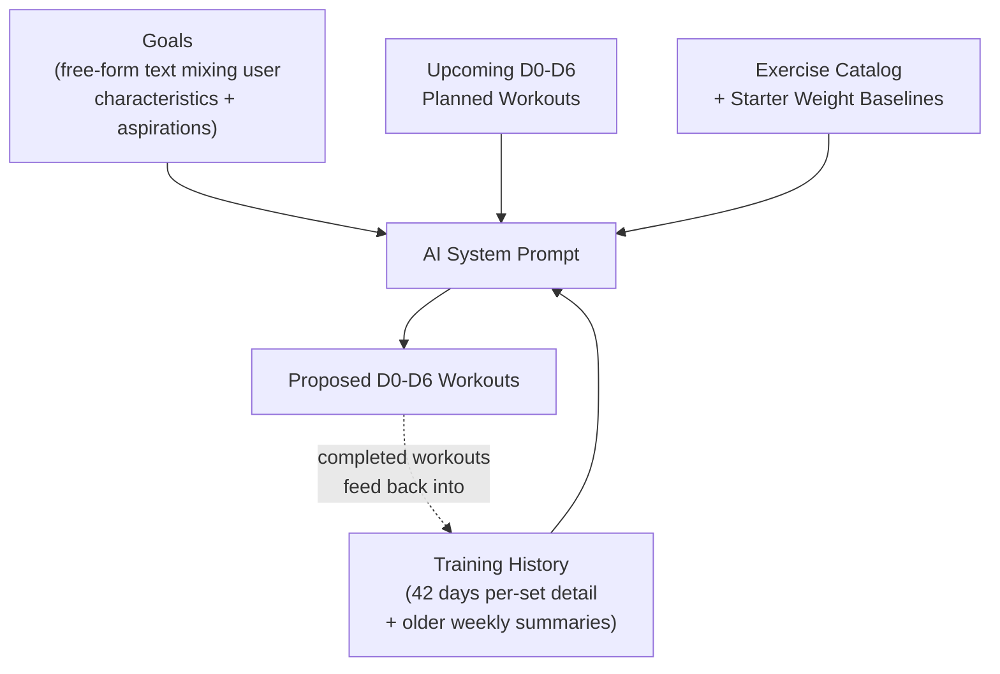
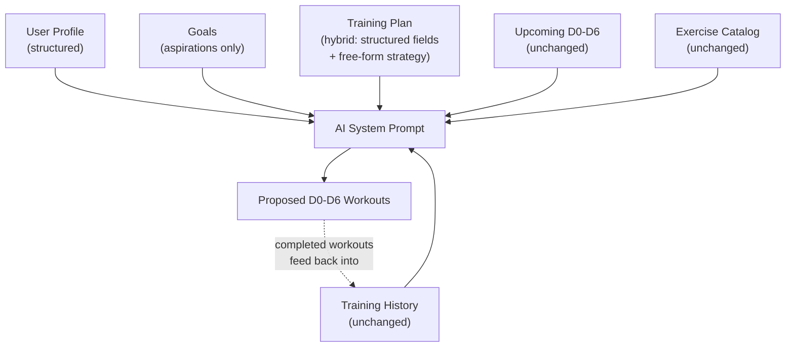

# Add Medium-Term Training Plan Layer

Split the current "goals" blob into three distinct concepts — User Profile (structured characteristics), Goals (aspirations only), and Training Plan (medium-term hybrid strategy) — and wire the training plan into the AI context so it is referenced when proposing workouts and giving feedback.

## Current Architecture



The system prompt already gives the AI rich context: recent workout outcomes with per-set difficulty, older weekly trend summaries, what's already scheduled, and the full exercise catalog with weight baselines. The problem is not a lack of data — it's the **absence of a durable training strategy** between goals and workout generation. The AI must re-derive the split, frequency, progression approach, and periodization logic from scratch on every planning turn. There is no persistent "plan" artifact that captures these medium-term decisions.

## Proposed Architecture



Three new/refactored data layers (history, upcoming workouts, and catalog are unchanged):

- **User Profile** — who you are (structured: experience, equipment, schedule, injuries)
- **Goals** — what you want (kept as free-form text, but now stripped of characteristics)
- **Training Plan** — medium-term strategy that integrates both (hybrid: key structured fields + AI-written strategy text)

## New Schemas

### UserProfile (`src/lib/schemas/profile.ts` — new file)

```typescript
{
  _v: 1,
  sex: 'male' | 'female' | null,
  experience: 'beginner' | 'intermediate' | 'advanced',
  availableDays: number,           // training days per week
  sessionMinutes: number | null,   // typical session length
  equipment: string[],             // e.g. ['full_gym'] or ['dumbbells', 'pullup_bar']
  injuries: string | null,         // free-form
  notes: string | null,            // anything else (age, preferences)
  updatedAt: string,
}
```

### TrainingPlan (`src/lib/schemas/trainingPlan.ts` — new file)

```typescript
{
  _v: 1,
  name: string,               // e.g. "6-Week Hypertrophy Block"
  split: string,               // e.g. "Push / Pull / Legs"
  daysPerWeek: number,
  durationWeeks: number,       // e.g. 4, 6, 8
  focus: string,               // e.g. "hypertrophy", "strength", "general fitness"
  strategy: string,            // AI-written free-form strategy (max 3000 chars)
                               // covers progression scheme, exercise priorities,
                               // deload timing, adaptation cues, etc.
  startDate: string | null,    // YYYY-MM-DD
  status: 'active' | 'completed',
  pendingReview: boolean,        // true when goals/profile changed since plan was written
  createdAt: string,
  updatedAt: string,
}
```

Both stored under fixed key `"current"` in IndexedDB (like goals — one active record at a time).

## Lifecycle and Consistency Rules

### Legacy data migration (existing users with goals but no profile/plan)

No code-level data migration. When an existing user opens the app:

- `init()` detects: goals exist, but profile is null → triggers `goal_review` mode
- The AI sees the existing goals text in context and is instructed to extract profile info from it
- Flow: `propose_profile` → `propose_goals` (cleaned, aspirations only) → `propose_training_plan`
- This is conversation-driven migration — the user confirms each step

### History context availability

Currently, workout history and upcoming-workout context are only assembled in `planning` mode (the `if (currentMode === 'planning')` gate in `doStream()`). For the AI to build a good training plan, it needs history in other modes too.

Fix: extend history assembly to also run in `goal_review` mode. For `onboarding`, include history if any workout data exists (handles returning users who cleared goals but have workout history).

### Plan invalidation rules

Add `pendingReview: boolean` to the `TrainingPlan` schema. Invalidation triggers:

- **Manual goal edit** (in Settings) → set `trainingPlan.pendingReview = true`
- **Manual profile edit** (in Settings) → set `trainingPlan.pendingReview = true`
- **Plan expiry** (startDate + durationWeeks < today) → `needsPlanReview()` returns true
- **No plan exists but goals do** → `needsPlanReview()` returns true

`needsPlanReview()` checks: `plan === null`, or `plan.pendingReview`, or plan is expired. Any of these trigger `goal_review` mode.

### Chat phase detection (checkpoint approach)

Rather than formal sub-states, use simple artifact-existence checks in `init()`:

- No profile → `onboarding` (system prompt tells AI to start with profile)
- Profile exists, no goals → `onboarding` (system prompt tells AI to focus on goals)
- Goals exist, no plan → `goal_review` (system prompt tells AI to create plan)
- `needsGoalReview()` or `needsPlanReview()` → `goal_review`
- All present, nothing stale → `planning`

The system prompt includes a "Setup Status" section listing which artifacts exist, so the AI knows where to pick up even after retry/recovery. Example: `Profile: set | Goals: set | Training Plan: missing — focus on creating a training plan.`

### Data precedence rules

When profile, goals, and plan contain overlapping information:

- **Profile = hard constraints** — the AI must respect these (available days, equipment, injuries)
- **Goals = aspirations** — what the user wants to achieve
- **Training Plan = current strategy** — constrained by profile, informed by goals

Specific rules enforced in the system prompt:

- `trainingPlan.daysPerWeek` must be ≤ `profile.availableDays`
- If profile lists injuries, the plan's strategy must account for them
- If goals change, the plan should be reviewed (enforced via `pendingReview`)

These are soft rules enforced via prompt instructions rather than hard schema validation, since the AI needs flexibility to propose reasonable plans.

## Changes By File

### 1. New schema files

- **`src/lib/schemas/profile.ts`** — `UserProfileSchema`, `ProposeProfilePayloadSchema`, `migrateProfile()`
- **`src/lib/schemas/trainingPlan.ts`** — `TrainingPlanSchema`, `ProposeTrainingPlanPayloadSchema`, `migrateTrainingPlan()`
- **`src/lib/schemas/index.ts`** — re-export both new modules

### 2. Database (`src/lib/db.ts`)

- Bump `DB_VERSION` from 2 to 3
- Add stores in `upgrade()`: `profile` (out-of-line key) and `trainingPlan` (out-of-line key)
- Add CRUD: `getProfile()`, `saveProfile()`, `getTrainingPlan()`, `saveTrainingPlan()`, `clearProfile()`, `clearTrainingPlan()`
- Update `clearAllData()` to include the two new stores

### 3. AI Context (`src/lib/context.ts`)

- Import new types
- Update `buildSystemPrompt()` signature to accept `profile` and `trainingPlan`
- Add `## User Profile` section (structured fields rendered as text)
- Add `## Training Plan` section (name, split, focus, duration, then full strategy text)
- Add `## Setup Status` section listing which artifacts exist (for checkpoint-based phase detection)
- Add data precedence rules to system prompt (profile = constraints, goals = aspirations, plan = strategy)
- Update `ROLE_INSTRUCTIONS` and `TOOL_INSTRUCTIONS` for onboarding and goal_review to reference the new tools
- Add `needsPlanReview()` — returns true if plan is null (but goals exist), plan.pendingReview is true, or plan is expired (startDate + durationWeeks < today)

### 4. Chat Tools (`src/lib/chatTools.ts`)

- Add `PROPOSE_PROFILE_TOOL` definition (structured fields)
- Add `PROPOSE_TRAINING_PLAN_TOOL` definition (hybrid fields)
- Add `ToolCardState` variants: `{ kind: 'profile'; ... }` and `{ kind: 'trainingPlan'; ... }`
- Extend `resolveToolCall()` to handle both new tools
- Add schema hints for the new tools in `getToolSchemaHint()`

### 5. Tool Cards (`src/components/ToolCard.tsx`)

- Add `ProposeProfileCard` — displays structured fields in a readable layout, accept/reject
- Add `ProposeTrainingPlanCard` — shows structured header (name, split, days, duration, focus) plus strategy text, accept/reject

### 6. Chat Screen (`src/screens/Chat.tsx`)

- Load profile and training plan in `init()`
- Pass them to `buildSystemPrompt()`
- Conversation mode logic: use checkpoint approach (profile exists? goals exist? plan exists? stale?) to select mode
- Extend history assembly in `doStream()` to also run for `goal_review` mode (and `onboarding` if workout data exists)
- Make `propose_profile` and `propose_training_plan` available as tools in onboarding + goal_review modes; also make `propose_training_plan` available in planning mode
- Add `handleAcceptProfile()` and `handleAcceptTrainingPlan()` handlers
- After accepting profile in onboarding, AI continues conversation (toward goals, then plan)
- After accepting goals in onboarding, AI continues (toward training plan, then workouts)
- After accepting training plan, AI transitions to planning mode to propose workouts
- Render the new tool cards in the UI

### 7. Settings (`src/screens/Settings.tsx`)

- Add a "Profile" section above Goals showing the structured user profile (read-only view with an "Edit in Chat" prompt, or a manual edit form)
- Add a "Training Plan" section below Goals showing the active plan's structured fields and strategy text
- Manual profile edit → also set `trainingPlan.pendingReview = true`
- Manual goals edit → also set `trainingPlan.pendingReview = true` (already sets `goals.pendingReview`)
- Update data management actions to include profile and plan clearing

## Conversation Flow Changes

**Onboarding** (new user, no profile/goals/plan):

1. AI asks about background, equipment, schedule, injuries
2. AI calls `propose_profile` — user accepts
3. AI asks about goals/aspirations
4. AI calls `propose_goals` — user accepts
5. AI calls `propose_training_plan` (informed by profile + goals) — user accepts
6. Mode switches to planning; AI proposes first week of workouts

**Goal review** (goals stale, plan expired, or plan missing):

1. AI reviews current goals, asks about changes
2. Optionally updates profile via `propose_profile`
3. Updates goals via `propose_goals`
4. Updates plan via `propose_training_plan`
5. Mode switches to planning

**Planning** (normal operation):

- AI references profile + goals + training plan when proposing workouts
- Plan's structured fields (split, days/week) guide the workout structure
- Plan's strategy text guides progression, exercise selection, periodization
- User can ask to update the plan at any time via `propose_training_plan`
